# codex-loop

> **In one line:** codex-loop turns Claude Code into a self-running build loop in any repo. It
> splits the backlog between Claude and Codex — Claude also orchestrates, verifying, merging,
> and shipping the work — with every task tracked as a GitHub issue. The loop paces itself, so
> the only reason to kick it by hand is to start the next round sooner than its timer would fire.

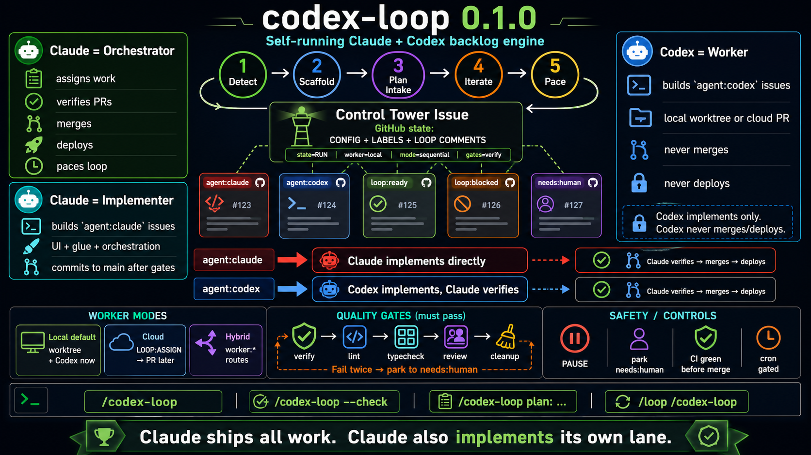

A **repo-agnostic** orchestration engine that lets **Claude Code control the work handed to
Codex** — using **GitHub issues as the single source of truth for state and tracking** — and
**eliminates the manual "kick the loop again" step**.

Claude orchestrates, verifies, merges, and deploys; Codex implements assigned work. A normal
loop stops whenever the queue momentarily empties or a tick ends, and a human restarts it.
codex-loop closes that gap, in **whatever repo you invoke it from** — it hardcodes no project.

- **Issue-driven control.** Every unit of work is a GitHub issue. Its labels + a small comment
  grammar *are* the state machine. Nothing lives in the model's head between ticks; state
  survives restarts because it lives in GitHub.
- **No manual restarts.** The orchestrator paces itself — poll tight while work is in flight,
  back off when idle, halt when drained or paused — instead of running one tick and waiting.

---

## Table of contents

- [Requirements](#requirements) — dependencies & required config
- [Quick start](#quick-start)
- [Commands](#commands) — how you invoke it
- [Configuration options](#configuration-options) — the Control Tower config block
- [Labels](#labels) — the operational vocabulary
- [How it manages Codex's work](#how-it-manages-codexs-work) — **how Codex is activated**
- [The autonomous loop](#the-autonomous-loop) — how restarts are eliminated
- [Guardrails](#guardrails)
- [Advanced guides](#advanced-guides) — wave mode, personas, and gated cron
- [Layout & scope](#layout--scope)
- [Wave orchestration & quality gates](docs/ORCHESTRATION.md) — opt-in parallelism + gate pipeline
- [Agent personas](docs/PERSONAS.md) — specialized roles (architect, verifier, reviewer, devops…)
- [Unattended cron](docs/CRON.md) — Phase 3 wiring + sign-off (gated)

> **See it end to end:** [docs/EXAMPLE-CYCLE.md](docs/EXAMPLE-CYCLE.md) walks one feature from
> a plan → assigned/chained issues → loop iterations → drain, with the actual comments and
> tick logs produced at each step.

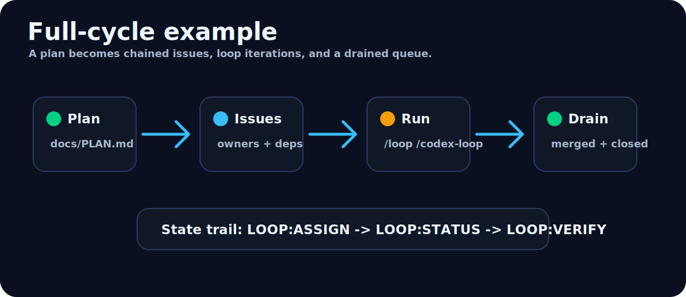

---

## Requirements

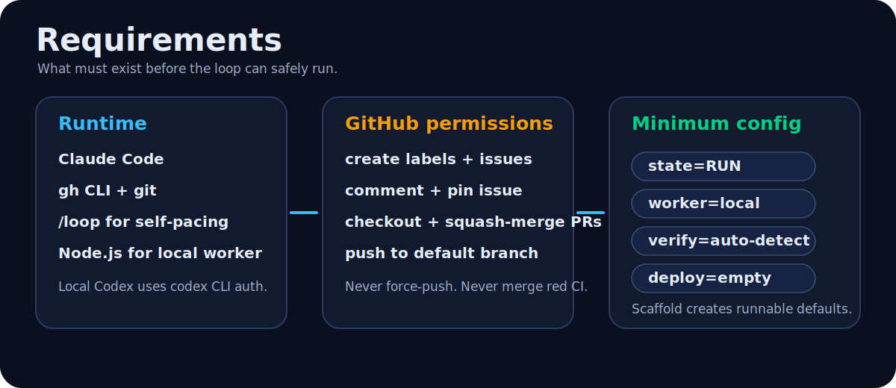

### Dependencies

| Dependency | Needed for | Notes |
|---|---|---|
| **Claude Code** | everything | The skill runs inside it; `/codex-loop` and `/loop` are Claude Code skills. |
| **`gh` CLI**, authenticated | everything | All state operations — create issues/labels, read comments, checkout/merge PRs. `gh auth status` must show the target repo's host. |
| **`git`** | everything | Worktrees, commits, push to the default branch. |
| **`/loop`** (built-in skill) | autonomous mode | Only needed for `/loop /codex-loop`. A bare `/codex-loop` runs one tick without it. |
| **`codex` CLI**, authenticated | `worker=local` (**default**) & `hybrid` | The loop drives it via `codex exec --json` (observable background run); verify with `codex doctor`. It's a **Node.js** app, so Node must be on PATH. Codex work bills to the **CLI's own auth** (ChatGPT/Codex subscription, or an OpenAI API key) — **not** Claude/Anthropic tokens. Not needed if you run `worker=cloud`. |
| **Node.js** | `worker=local` / `hybrid` | Transitive — the `codex` CLI is a Node app. |
| **Codex Cloud agent** wired to the repo | `worker=cloud` only | External setup in ChatGPT/Codex Cloud: GitHub access to the repo + the `agent:codex loop:ready` label in its watch scope. The skill does not create this. |
| A working **CI/verify command** | verification | Auto-detected (`npm`, `pytest`, …) or set via the `verify` config key. |

### GitHub permissions

The authenticated `gh` account must be able to, in the target repo: create labels + issues,
pin an issue, comment, **checkout and squash-merge PRs**, and **push to the default branch**.
If the default branch is **protected** (required reviews / status checks), the loop's
auto-merge and direct push will be blocked — either grant the account bypass, relax the rule,
or run the loop against a branch it may merge into. The loop never force-pushes and never
merges on red CI.

### Required config

Config lives in the Control Tower issue's `CODEX-LOOP:CONFIG` block (created by scaffolding).
Every key has a working default, so the **minimum required config is nothing** — scaffolding
produces a runnable loop. You typically set these before real use:

| Key | Set it when | Default if unset |
|---|---|---|
| `worker` | you can't run Codex locally → `cloud`; or want per-issue routing → `hybrid` | `local` |
| `verify` | auto-detect can't infer your CI (monorepo, custom runner) | auto-detect |
| `deploy` | you want the loop to deploy | *(empty — never deploys)* |
| `priority` | queue order should follow backlog files, not issue number | issue number ascending |
| `trailer` | you want a specific commit co-author/trailer | `Co-Authored-By: Claude …` |

`state=RUN` is seeded by scaffolding and is the only key the loop *reads to decide whether to
run at all* — set it to `PAUSE` to halt. See [Configuration options](#configuration-options)
for the full reference.

---

## Quick start

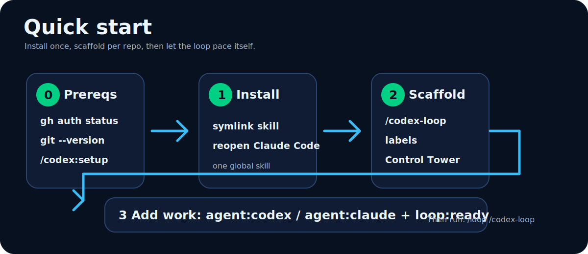

**0. Prerequisites.** Confirm the [dependencies](#requirements) for your worker mode:

```bash
gh auth status            # authenticated for the target repo?
git --version             # git present
# only for the default local worker:
codex doctor              # verifies the codex CLI is installed + authenticated
```

**1. Install the skill globally** (once):

```bash
mkdir -p "$HOME/.claude/skills"
ln -sfn "$HOME/Code/codex-loop/skills/codex-loop" "$HOME/.claude/skills/codex-loop"
```

Reopen your Claude Code session so it loads. `/codex-loop` is now invocable in any repo.

**2. First run in a repo** — auto-detect + scaffold:

```
/codex-loop
```

It detects the repo isn't set up, explains what it will create, and — **after you confirm** —
creates the [labels](#labels) and a pinned **Control Tower issue** seeded with a
[config block](#configuration-options). Then it stops. Edit that config block now if you need a
non-default [`worker`/`verify`/`deploy`](#required-config).

**3. Add work.** Open issues for the things you want done, labeling each `agent:codex loop:ready`
(Codex implements) or `agent:claude loop:ready` (Claude implements). Chain-blocked work gets
`loop:blocked` instead, and is unblocked automatically as predecessors merge. To turn a whole
plan into assigned, chained issues at once, run `/codex-loop plan: <file>` (see
[the full-cycle example](docs/EXAMPLE-CYCLE.md)).

**4. Run it.** One tick to watch it, or hand it the cadence to run hands-off:

```
/codex-loop            # one iteration, then stop
/loop /codex-loop      # autonomous: self-paces the next iteration — no manual restarts
```

---

## Commands

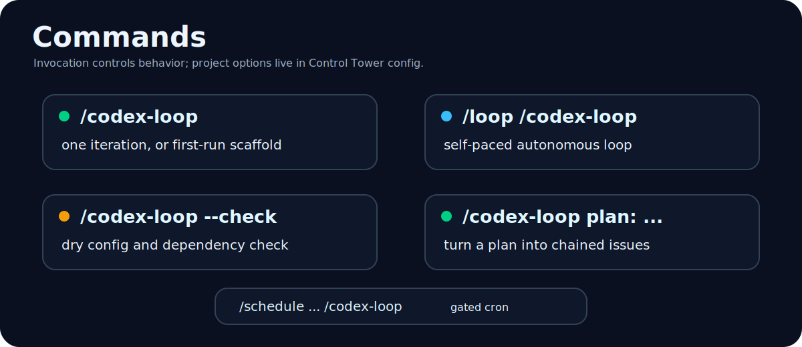

codex-loop has no bespoke CLI flags of its own — you drive it by *how you invoke the skill*.
The tunable "options" live in the [config block](#configuration-options), not on the command.

- **`/codex-loop`**
  Run **one iteration** and stop. On a fresh repo this is instead the **detect + scaffold**
  flow. Use it to dry-run and watch behaviour.

- **`/loop /codex-loop`**
  **Autonomous, self-paced.** Each wake runs one iteration; the skill schedules the next itself
  (tight while a PR/deploy is in flight, back off when idle, halt when drained). This is the
  mode that **eliminates manual restarts**.

- **`/loop 10m /codex-loop`**
  Fixed-interval alternative — a tick every 10 min regardless of state. Simpler but less
  efficient (burns empty ticks); prefer the self-paced form above.

- **`/schedule … /codex-loop`**
  *(Future, gated.)* Unattended cron routine — runs with the session closed. Off by default;
  see [ROADMAP](docs/ROADMAP.md).

**Pausing / stopping**

- **Pause:** set `state=PAUSE` in the Control Tower config block. The loop no-ops each
  iteration and, under `/loop`, backs off and **auto-resumes** when you set it back to `RUN`.
- **Stop:** pause it, or interrupt the session.

---

## Configuration options

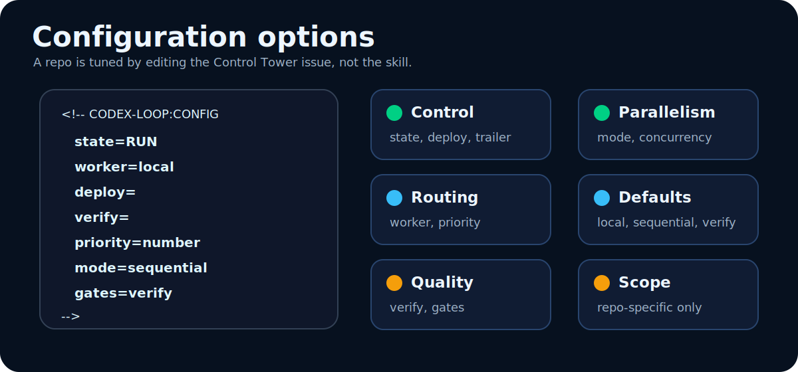

All project-specific behaviour lives in a `CODEX-LOOP:CONFIG` block in the **Control Tower
issue body** — not in the skill. Edit the issue to retune the loop; changes take effect on the
next iteration.

```
<!-- CODEX-LOOP:CONFIG
state=RUN
worker=local
codexTimeoutSec=900
codexStallSec=240
fallback=claude
deploy=
verify=
priority=number
mode=sequential
concurrency=1
gates=verify
trailer=Co-Authored-By: Claude <noreply@anthropic.com>
-->
```

| Key | Values | Default | What it does |
|---|---|---|---|
| `state` | `RUN` \| `PAUSE` | `RUN` | The **kill switch**. `PAUSE` halts every iteration until it reads `RUN`. First token wins. |
| `worker` | `local` \| `cloud` \| `hybrid` | `local` | How Codex is activated (see [below](#how-it-manages-codexs-work)). `local` runs Codex in-session (needs the `codex` CLI); `hybrid` routes per issue via `worker:*` labels. |
| `codexTimeoutSec` | integer | `900` | **Local worker.** Hard wall-clock deadline for a `codex exec` run before it's killed and falls back. |
| `codexStallSec` | integer | `240` | **Local worker.** Kill if the JSONL log hasn't grown for this long (a frozen trajectory = hung). |
| `fallback` | `claude` \| `park` | `claude` | **Local worker.** On Codex stall / deadline / verify-fail: `claude` = Claude implements the issue itself this iteration; `park` = relabel `needs:human`. Either way the queue keeps moving. |
| `deploy` | shell command | *(empty)* | Deploy command. **Empty = never deploy.** Runs only when set **and** the issue's Deployment Expectation asks. |
| `verify` | shell command(s) | *(empty)* | CI / verification command. **Empty = auto-detect** (`npm ci && npm test`, `pytest`, etc. from the repo). |
| `priority` | `number` \| file paths | `number` | Queue order. `number` = issue number ascending; or a comma-separated list of backlog file paths to read in order. |
| `mode` | `sequential` \| `wave` | `sequential` | `wave` processes the whole ready set in parallel (up to `concurrency`); `sequential` does one issue per tick. See [Wave orchestration](docs/ORCHESTRATION.md). |
| `concurrency` | integer ≥ 1 | `1` | Max issues implemented at once in wave mode. Merges still serialize onto the default branch. |
| `gates` | `verify,lint,typecheck,review,cleanup` | `verify` | Quality gates run before every merge; a failing gate bounces the issue. `review` spawns an independent verifier/reviewer subagent. |
| `trailer` | text | `Co-Authored-By: Claude …` | Trailer appended to every commit message the loop makes. |

---

## Labels

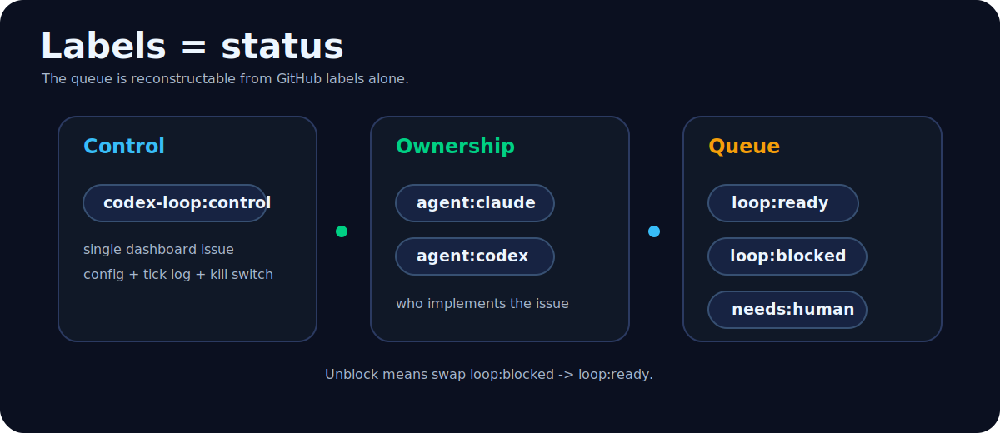

The skill creates these on first run. They are intrinsic to codex-loop, not to any project.

| Label | Meaning |
|---|---|
| `codex-loop:control` | Marks the single Control Tower issue (config + dashboard + kill switch). |
| `agent:codex` | This issue's work belongs to **Codex**. |
| `agent:claude` | This issue's work belongs to **Claude** (implemented directly). |
| `loop:ready` | Actionable now — eligible to be picked up this tick. |
| `loop:blocked` | Gated on a predecessor; not yet actionable. Swapped to `loop:ready` when the predecessor merges. |
| `needs:human` | **Parked.** The loop must not act — a human decides. |
| `worker:*` | *(hybrid mode only)* Tag an issue `worker:local` or `worker:cloud` to route it to that Codex surface. |

---

## How it manages Codex's work

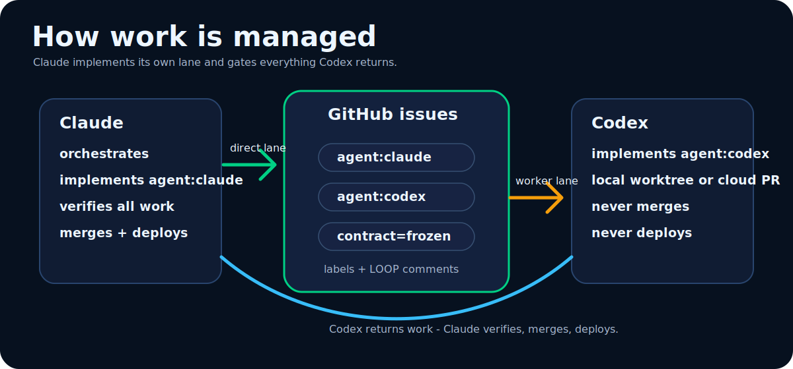

This is the core of the engine. Claude never lets Codex run free — it hands Codex **one frozen,
verifiable unit of work at a time** and gates everything Codex produces. There are **two ways
Codex is activated**, chosen by the `worker` config; they differ fundamentally.

### The shared lifecycle (both modes)

```
Claude picks the next  agent:codex loop:ready  issue (by priority)
   │
   ├─ Park check — money/legal/external-comms/destructive/ambiguous? → needs:human, skip
   │
   ├─ Freeze the contract in the issue body: pin types, API shape, migration id, acceptance.
   │  ("contract=frozen" is a promise the spec won't shift under Codex mid-implementation.)
   │
   └─ Activate Codex ──▶ (cloud OR local, below) ──▶ Codex returns work
                                                         │
Claude verifies: run `verify` cmd + the issue's Verification Plan + review the diff
   ├─ pass → merge, LOOP:VERIFY verdict=pass, close issue, unblock its chain successor
   └─ fail → LOOP:VERIFY verdict=bounce with reproducible findings; leave loop:ready
             (two consecutive bounces on one issue → needs:human)
```

Freezing the contract first is what makes Codex's output verifiable — Claude knows exactly
what "correct" means before Codex starts. Claude is the **sole merger and deployer**; Codex
never merges or deploys.

### Local Codex (`worker=local`, default)

Claude **activates Codex directly, in-session**, via the [`codex` CLI](https://github.com/openai/codex)
— but as an **observable, bounded, fallible background process**, never a blocking black box. (A
blocking subagent makes a 20-minute stall look identical to real progress; the streamed JSONL log
below is the instrument that tells them apart.)

```
Claude:  preflight `codex doctor`  — unhealthy? skip straight to Claude-fallback
         cut a fresh git worktree off the default branch
         launch, in the BACKGROUND, the frozen contract via the non-interactive CLI:
             codex exec --json -C <worktree> -s workspace-write \
                 -o codex-<NN>.result  "<frozen contract>"  > codex-<NN>.jsonl 2>&1
                                   │
                                   ▼   (poll the JSONL every ~60–90s — growing = working, frozen = hung)
         watch:  stall  = no new lines for codexStallSec (240s)   ─┐
                 deadline = wall-clock past codexTimeoutSec (900s) ─┤──▶ kill + post last ~40 lines
                                   │                                     + `-o` result, then fallback
              clean exit ─────────┤────────── stall / deadline / verify-fail ──┘
                                   ▼                                       fallback=claude → Claude
Claude:  INDEPENDENTLY verify (own test run, not Codex's) →                 implements this iteration
         commit (trailer) → push default branch → close → git worktree remove   · or park (needs:human)
```

**What activates Codex here:** Claude launches `codex exec --json` the instant it has a frozen
contract and watches the streamed JSONL trajectory — `item.started`/`item.completed` events are
Codex's tool calls, `agent_message` events its reasoning — to tell *working* from *hung*. A stall
or deadline kills the run, posts the last JSONL lines + the `-o` result (so it's debuggable, never a
lost black box), and falls back per config, so a wedged Codex **never blocks the queue**. `-C
<worktree>` keeps edits isolated; Claude re-verifies independently, so verify still happens the
**same iteration** and Codex never sits idle. Cost: runs on your machine, session open, under your
local `codex` CLI's own auth (ChatGPT/Codex subscription or OpenAI key) — **not** Anthropic tokens.
Requires the `codex` CLI installed and authenticated (`codex doctor` to check). Tunable via
`codexTimeoutSec` / `codexStallSec` / `fallback` (see [Configuration](#configuration-options)).

> **See what a run is doing.** Every local run leaves a `codex-<NN>.jsonl` next to its worktree.
> Open [`tools/codex-json-viewer.html`](tools/codex-json-viewer.html) in any browser and drop the
> file in to read the whole trajectory — reasoning, shell commands (with exit codes + output), and
> file edits, in order. No build, no server, nothing uploaded.

### Cloud Codex (`worker=cloud`)

Claude **activates Codex by writing a signal into GitHub**; an externally-configured Codex
Cloud agent reacts to it.

```
Claude:  label issue  agent:codex loop:ready
         post  <!-- LOOP:ASSIGN agent=codex issue=NN contract=frozen -->
                                   │
                                   ▼   (activation happens OUTSIDE this skill)
Codex Cloud  — the ChatGPT/Codex Cloud agent you connected to this repo with GitHub access —
             sees the assignment, implements it, and opens a  codex/*  PR, posting:
                 <!-- LOOP:STATUS agent=codex issue=NN state=pr-open pr=### -->
                                   │
                                   ▼   (next iteration)
Claude:  reads that STATUS marker → gh pr checkout → verify → merge or bounce
```

**What activates Codex here:** the `agent:codex loop:ready` label + the `LOOP:ASSIGN` comment
are the trigger. The actual pickup depends on **Codex Cloud being wired to the repo**
separately (in ChatGPT/Codex Cloud, with GitHub access and the loop's label in its watch
scope). The skill produces the *state* Codex reacts to — it does not itself start the cloud
agent. Fire-and-forget, but it has an **idle gap**: Codex sits idle between opening a PR and
the next iteration assigning it more work.

### Hybrid (`worker=hybrid`)

Route per issue: label an issue `worker:local` for the synchronous in-session path or
`worker:cloud` for fire-and-forget. Good for running small/urgent items locally while leaving
large ones to the cloud.

---

## The autonomous loop

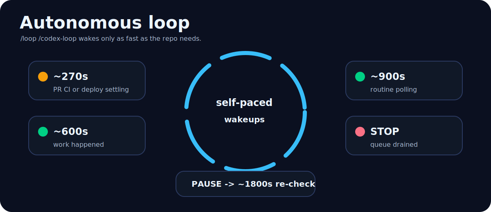

Under `/loop /codex-loop`, after each iteration the skill decides when to wake next instead of
waiting for you — this is what removes the manual restart:

| Situation | Next wake | Why |
|---|---|---|
| A PR is mid-CI, or a deploy is settling | **~270s** | Stays inside the prompt-cache window; poll tight. |
| Work happened this iteration | **~600s** | Keep momentum without busy-waiting. |
| Only routine polling, nothing in flight | **~900s** | Idle-ish; check back periodically. |
| **Both queues drained** | **stop** | Posts "queue drained" on the Control Tower issue and idles. |
| `state=PAUSE` | **~1800s** | Soft re-check; auto-resumes when set to `RUN`. |

A max-iterations / cost backstop halts the loop regardless, and logs why.

---

## Guardrails

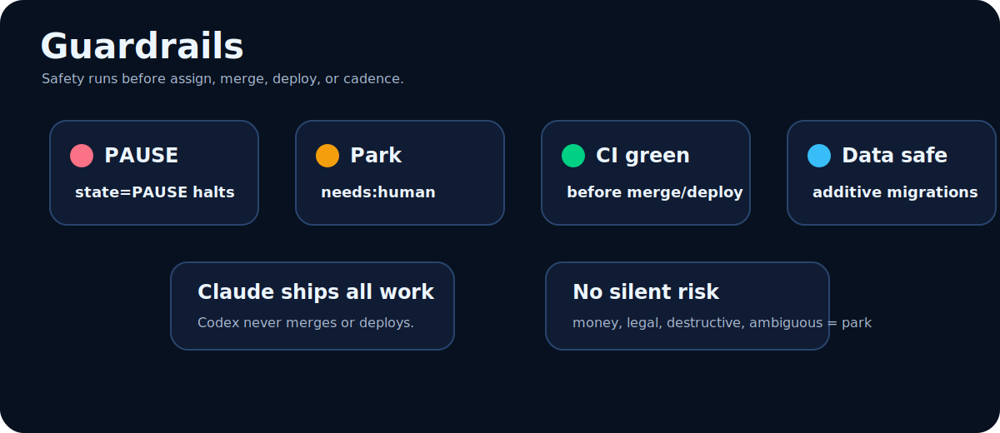

Applied **every iteration**, inside the guard/park path — not optional:

- **PAUSE** halts the loop. **Park for human** (`needs:human`, don't act) on money/vendor/
  licensing, legal/agreements, external-facing comms, unauthorized destructive migrations, and
  anything genuinely ambiguous. **When unsure, park.**
- **CI green before merge/deploy** — never leave the default branch red.
- **Data safety** — prefer additive/idempotent migrations; never reseed/drop live data or
  destroy audit trails without explicit issue authorization.
- **Deploy only when configured and the issue asks.**
- **Claude is the sole merger + deployer;** Codex never merges or deploys.

The largest risk in autonomy isn't the looping — it's a loop that skips the park check. That
check runs before any assign/merge/deploy, by construction.

---

## Advanced guides

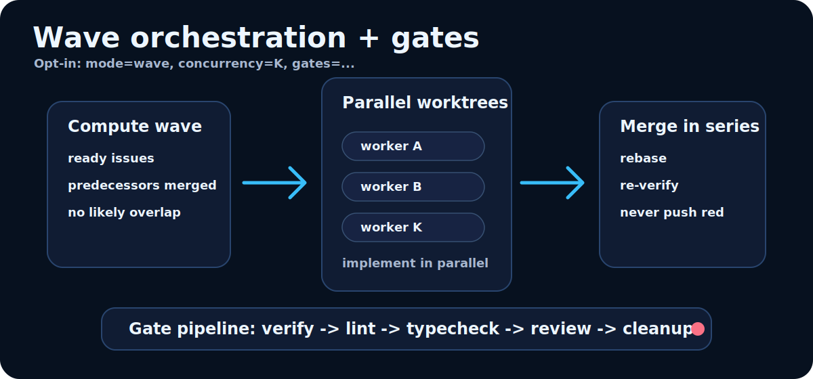

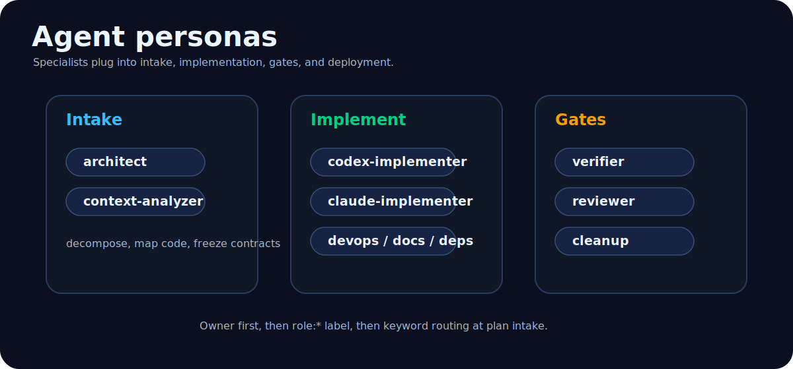

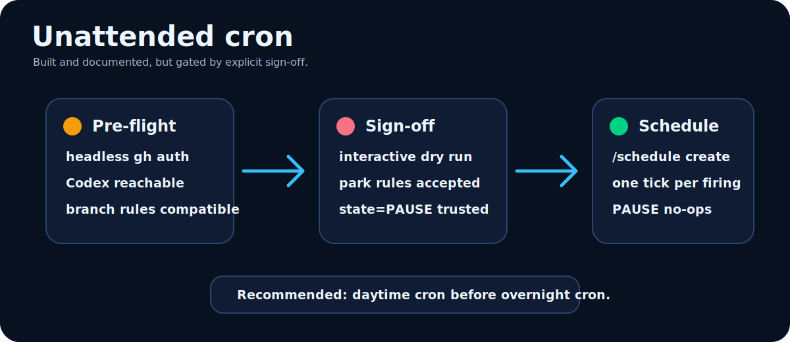

---

## Acknowledgements

codex-loop's wave orchestration, plan-intake decomposition, specialized-persona routing, and
quality-gate ideas were influenced by
[`barkain/claude-code-workflow-orchestration`](https://github.com/barkain/claude-code-workflow-orchestration).
This repo reimplements those ideas from scratch for a GitHub-issue-driven Claude/Codex loop;
no code or prompts from that project are copied or vendored. The detailed attribution lives in
[docs/ORCHESTRATION.md](docs/ORCHESTRATION.md#scope--attribution) and
[docs/PERSONAS.md](docs/PERSONAS.md#scope--attribution).

---

## Layout & scope

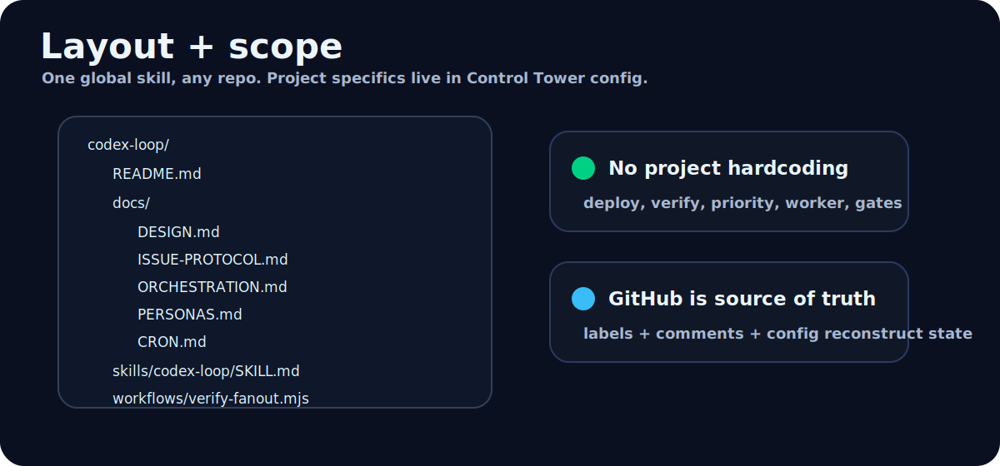

```
codex-loop/
├── README.md
├── docs/
│   ├── DESIGN.md            ← stall points, detect→scaffold→iterate→pace, guardrails
│   ├── ISSUE-PROTOCOL.md    ← labels + LOOP:* grammar + Control Tower config = the state machine
│   ├── ORCHESTRATION.md     ← opt-in parallel waves + quality gates (reimplemented from barkain)
│   ├── PERSONAS.md          ← specialized agent personas + how they're selected/dispatched
│   ├── EXAMPLE-CYCLE.md     ← full worked example: plan → issues → loop → drain
│   ├── INSTALL.md           ← global install, first-run scaffolding, running the loop
│   ├── CRON.md              ← unattended-cron wiring + sign-off checklist (gated)
│   └── ROADMAP.md           ← phased plan (validation evidence per item)
├── CHANGELOG.md
├── skills/codex-loop/SKILL.md   ← the invocable /codex-loop orchestrator
├── workflows/verify-fanout.mjs  ← deterministic parallel PR verification (Workflow asset)
└── tools/codex-json-viewer.html ← open in a browser to read a local run's codex-<NN>.jsonl trajectory
```

The skill contains no project-specific code. Everything a given repo needs — deploy command,
CI command, priority order, worker mode, the kill switch — lives in that repo's Control Tower
issue config block, created on first run. One global skill, any repo.
